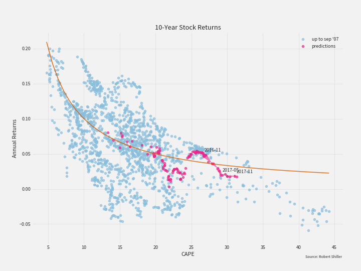
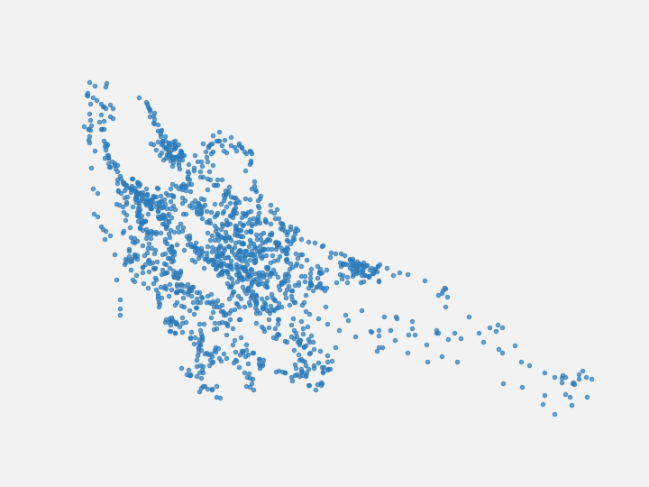
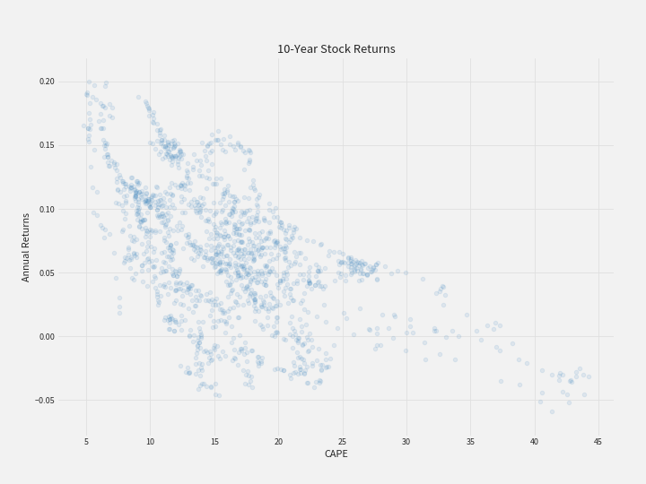
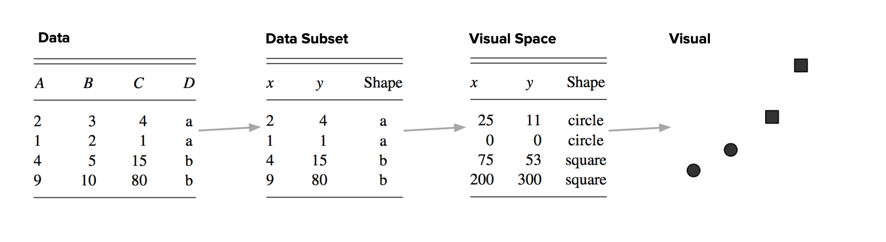
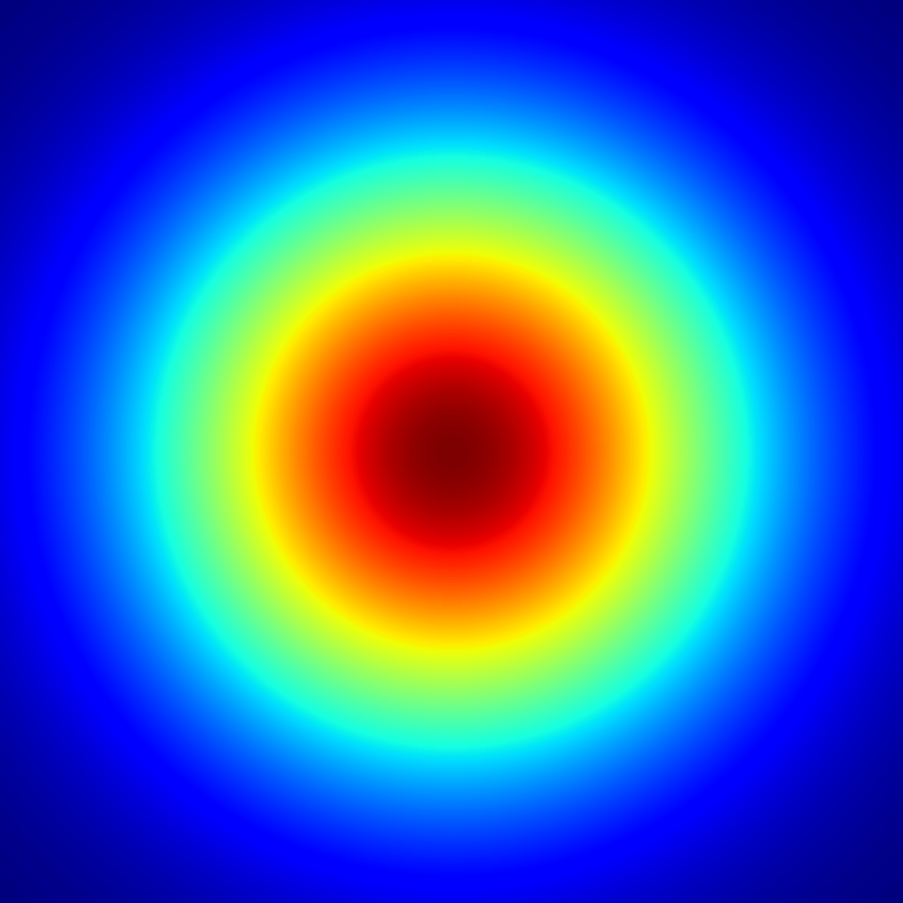
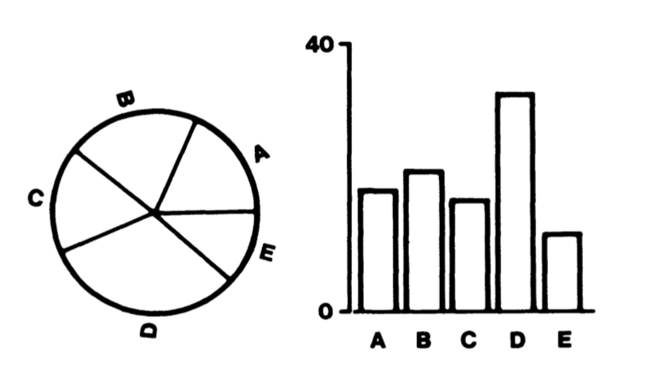
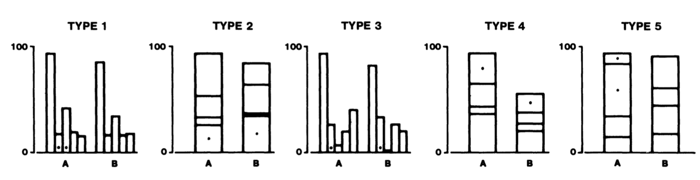
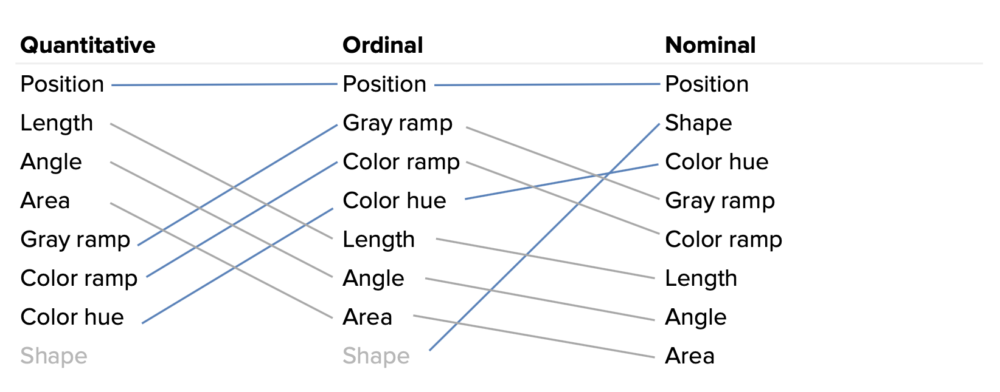
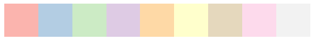

# A Very, Very Brief Introduction to Data Visualization (Part I)

# About Me
<br>
<div style="font-size: larger;">
Chandrasekhar (Sekhar) Ramakrishnan<br>
<a href="https://twitter.com/ciyer">@ciyer</a><br>
<br>
<a href="https://datascience.ch">Swiss Data Science Center</a> and freelance data scientist; teach data viz at <a href="https://propulsion.academy">Propulsion Academy</a>

<a href="https://illposed.com"></a>

# The Goal of Data Visualization

## The goal of visualizing data is to enable quantitative reasoning with your eyes

There are many valid answers to this question. One of them is the above. It is not the only answer, but it is the answer we will pursue here.

## One data set, two goals

<table>
    <tbody>
        <tr>
            <td></td>
            <td></td>
        </tr>
    </tbody>
</table>

From FlowingData https://flowingdata.com/2010/09/30/advertised-vs-actual-waistline/

Consider these two visualizations of the same data set. They are both good, but they look very different because they pursue different goals.

The one on the right is a visualization of the kind we will be talking about: one designed to enable quantitative reasoning. The one on the left has a different goal: its goal is to be entertaining. This is of course fine, and this visualization does a good job of realizing this goal, but it is not the kind of visualization we will be talking about.

# Table of Contents

* Tools for making visualizations
* Thinking about visualizations
* Scales of measurement
* Selecting mappings
* Working with color
* Transformations to bring out relationships

(Pt 2. covers multi-dimensional data, layering, context, small multiples/faceting)

This introduction is made up of several sections. We will first survey some tools for making visualizations. Then we will develop some concepts and terminology to think about visualizations. The bulk of the material is in the final two sections which focus on choosing mappings from data to visuals and ways of providing context in data visualizations, respectively.

# References

<div style="display: flex; flex-direction: row;  justify-content: space-around">

<div>

<h2>Edward Tufte</h2>
<ul>
<li><a href="https://www.amazon.com/Visual-Display-Quantitative-Information/dp/0961392142/">Visual Display of Quantitative Information</a></li>
<li><a href="https://www.amazon.com/Envisioning-Information-Edward-R-Tufte/dp/0961392118/">Envisioning Information</a></li>
<li><a href="https://www.amazon.com/Visual-Explanations-Quantities-Evidence-Narrative/dp/0961392126/">Visual Explanations</a></li>
</ul>

</div>

<div>

<h2>Online</h2>
<ul>
<li><a href="https://magrawala.github.io/cs448b-fa17/">Maneesh Agrawala’s Visualization Course</a></li>
<li><a href="https://courses.cs.washington.edu/courses/cse442/17au/">Jeffrey Heer’s Visualization Course</a></li>
<li><a href="https://www.tableau.com/sites/default/files/media/designing-great-visualizations.pdf">Jock Mackinlay’s Designing Great Visualizations</a></li>
</ul>

</div>
</div>


<!-- * Müller-Brockmann -->

These materials here borrow extensively from others.

# Tools for Visualization

There are many tools out there for making visualizations. You may already be very familiar with one. In this presentation, we will not go into any of them in detail, but you may be interested to know what is out there.

## Non-Programming

* Excel / Numbers / etc.
* [Tableau](https://www.tableau.com)
* [Spotfire](https://www.tibco.com/products/tibco-spotfire)
* [Power BI](https://powerbi.microsoft.com/en-us/)

Widely used spreadsheet software, like Excel, offer tools for making visualizations from tables of data. These have limited flexibility, but are very easy to use.

Tableau, Spotfire, and Power BI are all GUI-driven tools specifically for data visualization.

<div style="display: flex; flex-direction: row;  justify-content: space-around">

<div style="width: 300px">
<h2>R</h2>
<ul>
<li>ggplot</li>
</ul>
</div>

<div style="width: 430px">
<h2>Python</h2>
<ul>
<li>matplotlib</li>
<li>seaborn</li>
<li>bokeh</li>
<li>altair</li>
<li>HoloViews</li>
</ul>
</div>

<div style="width: 430px">
<h2>JavaScript</h2>
<ul>
<li><strong><a href="https://vega.github.io/vega/">Vega</a> / <a href="https://vega.github.io/vega-lite/">Vega-Lite</a></strong></li>
<li><a href="https://d3js.org">D3</a></li>
<li><a href="https://c3js.org">C3</a></li>
<li><a href="https://plot.ly">plot.ly</a></li>
</ul>
</div>
</div>

Programming languages also provide frameworks for data visualization, including, of course, widely used languages for data analysis like R and Python. The landscape in R is cleaner, in Python there has been much recent activity to develop modern, web-friendly alternatives to the classic matplotlib.

And JavaScript, though not typically an an environment for data analysis, is the primary programming language for the web and has powerful frameworks for visualizing data.

I am not going to say much about all of these in detail, but I wanted to highlight Vega and Vega-Lite, which are declarative specifications for describing data visualizations.

# Thinking About Visualizations

Our goal of support quantitative reasoning visually has implications for how we build visualizations.

## The parts of a visualization



## Marks



The core of a visualization is made up of the marks that represent data.

## Context: axes, tick marks, title (legend)



## Context: model, predictions, labels


## Marks are defined by mapping


## Visualization maps from data to marks in an image



Visualizations are realized by mapping data variables to visual variables

Visual variables include position, shape, brightness, hue (color), transparency. Doing this well requires being aware of what visual variables we have at our disposal and drawing upon knowledge from graphic design (colors, typography, layout), psychology/human factors, and statistics. It may be necessary to apply a transformation to the data along the way.

## Visual inferences should be valid data inferences



To make quantitative reasoning possible through your eyes, we need to choose mappings that ensure that visual inferences are valid data inferences. Look at the above visualization. How do you expect the underlying data to be distributed? You probably see contours and bands of similar values. We will later look back at this and see if the data matches.

# Scales of Measurement

In statistics, measurements occur on a scale, and for different scales, different kinds of operations are possible. Visualizations need to take scales of measurements into account.

<div style="width: 800px">
<table class="table table-sm" style="font-size: 18px">
    <thead>
        <tr>
            <th>Scale</th>
            <th>Type</th>
            <th>Properties</th>
        </tr>
    </thead>
    <tbody>
        <tr>
            <td>Nominal</td>
            <td>Label</td>
            <td>Qualitative, no ordering</td>
        </tr>
        <tr>
            <td>Ordinal</td>
            <td>Label or Number</td>
            <td>Ordered, but not otherwise comparable</td>
        </tr>
        <tr>
            <td>Interval</td>
            <td>Number</td>
            <td>Differences can be compared</td>
        </tr>
        <tr>
            <td>Ratio</td>
            <td>Number</td>
            <td>Has a fixed zero, can divide one value by another</td>
        </tr>
    </tbody>
</table>
</div>

<div style="width: 600px">
<table class="table table-sm" style="font-size: 18px">
    <thead>
        <tr>
            <th>Scale</th>
            <th>Examples</th>
        </tr>
    </thead>
    <tbody>
        <tr>
            <td>Nominal</td>
            <td>Gender, color, city, species</td>
        </tr>
        <tr>
            <td>Ordinal</td>
            <td>Happy/indifferent/unhappy, S/M/L/XL</td>
        </tr>
        <tr>
            <td>Interval</td>
            <td>Dates, temp (C)</td>
        </tr>
        <tr>
            <td>Ratio</td>
            <td>Meters, money, temp (K)</td>
        </tr>
    </tbody>
</table>
</div>

# Selecting Mappings

## Jacques Bertin, *Sémiologie Graphique* (1967)


Image from http://pauline-blot.blogspot.ch/2012/02/jacques-bertin.html

Bertin was a cartographer and semiotician who started thinking systematically about how do represent data in visual form.

## Jacques Bertin, *Sémiologie Graphique* (1967)

<div style="display: flex; flex-direction: row;  justify-content: space-around">

<div>
    
</div>

<div style="width: 20px">
    &nbsp;
</div>

<div style="width: 600px">
<table class="table table-sm" style="font-size: 18px">
    <thead>
        <tr>
            <th>Visual Variable</th>
            <th>Kind of Data</th>
        </tr>
    </thead>
    <tbody>
        <tr>
            <td>Position</td>
            <td>Nominal, Ordinal, Interval, Ratio</td>
        </tr>
        <tr>
            <td>Size</td>
            <td>Nominal, Ordinal, Interval, Ratio</td>
        </tr>
        <tr>
            <td>Brightness</td>
            <td>Nominal, Ordinal, Interval, Ratio</td>
        </tr>
        <tr>
            <td>Texture</td>
            <td>Nominal, Ordinal</td>
        </tr>
        <tr>
            <td>Hue</td>
            <td>Nominal</td>
        </tr>
        <tr>
            <td>Shape</td>
            <td>Nominal</td>
        </tr>
    </tbody>
</table>
</div>
</div>

He created a catalogue of visual variables that can be manipulated and considered the kinds of operations that we can do with those visual variables using our eyes. He used this to create a catalogue of possible mappings of data to visual variables using the constraint that any valid operation with the scale of measurement of the data should be possible with the visual variable.

## Cleveland & McGill, _Graphical Perception_ (1984)




Images from _Graphical Perception: Theory, Experimentation, and Application to the Development of Graphical Methods_, William S. Cleveland and Robert McGill, Journal of the American Statistical Association, Vol. 79, No. 387 (Sep., 1984), pp. 531-554

Whereas Bertin evaluated mapping strategies analytically, in the 1980s, two researchers, William Cleveland and Robert McGill set out to acquire quantitative data comparing the efficacy of different mappings.

They had subjects perform quantitative tasks using the same data presented with different mappings and evaluated performance in terms of speed and accuracy.

## Mackinlay *Automating the Design of Graphical Presentations of Relational Information* 1986



Redrawn from https://www.tableau.com/sites/default/files/whitepapers/designing-great-visual-communications.pdf

Jock Mackinlay used the catalogue of Bertin and the data from Cleveland and McGill to automate the choice of mappings. He summarized Cleveland and McGill's findings in a slopeograph.

# Color

Working with color can be tricky. Poor choice of color palette can render an otherwise good visualization completely useless.

## Visual inferences should be valid data inferences

<div style="display: flex; flex-direction: row;  justify-content: space-around">

<div style="width: 300px">
  
</div>
</div>

Here is the plot from earlier again. What do you think the data looks like?

## Visual inferences should be valid data inferences

<div style="display: flex; flex-direction: row;  justify-content: space-around">

<div style="width: 300px">
  
</div>
<div>
    &nbsp;
</div>
<div style="width: 300px">
  
</div>
</div>

Here is the same data shown using a grayscale colormap on the right.


```python
%matplotlib inline
import numpy as np
import pandas as pd
import matplotlib as mpl
import matplotlib.pyplot as plt
import seaborn as sns
sns.set(style='dark')

def get_image():
    delta = 0.0025
    x = y = np.arange(-1.5, 1.5, delta)
    X, Y = np.meshgrid(x, y)
    Z = np.exp(-X**2 - Y**2)
    return Z

cmaps = ['jet', 'gray', 'viridis']
fix, axs = plt.subplots(1, len(cmaps), figsize=(10, 10))
for ax, cmap in zip(axs, cmaps):
    ax.imshow(get_image(), cmap=cmap)
    ax.set_xticklabels([])
    ax.set_yticklabels([])
    ax.set_title(cmap)
```


# Kinds of palettes

* **Qualitative** for categorical data
* **Diverging** for numerical data with a clear central point
* **Sequential** for numerical data otherwise


```python
%matplotlib inline
import seaborn as sns

print("qualitative")
sns.palplot(sns.color_palette('Set1', 9))
sns.palplot(sns.color_palette('Pastel1', 9))
sns.palplot(sns.color_palette('Set3', 9))
```

    qualitative





```python
%matplotlib inline
import seaborn as sns

print("diverging")
sns.palplot(sns.color_palette('RdBu', 9))
sns.palplot(sns.color_palette('BrBG', 9))
sns.palplot(sns.color_palette('Spectral', 9))
```

    diverging


```python
%matplotlib inline
import seaborn as sns

print("sequential")
sns.palplot(sns.color_palette('YlGnBu', 9))
sns.palplot(sns.color_palette('PuRd', 9))
sns.palplot(sns.color_palette('Blues', 9))
```

    sequential


# Advice

- Use a carefully designed palette (e.g., [Colorbrewer](http://colorbrewer2.org))
- Tufte: Above all do no harm

# Transformations

(to be filled in)

# Hands-On

https://www.fueleconomy.gov/feg/download.shtml

Create visualizations to answer the following questions:
- Are 1999 autos more or less efficient than 2008?
  - In general?
  - Same model?
- Is one manufacturer more or less efficient than the avg?
- Does type of car show a relationship to fuel efficiency?
- Does engine size show a relationship to fuel efficiency?

Burtin Antibiotics data to illustrate transforms


# Part II Teaser

(Pt 2. covers multi-dimensional data, layering, context, small multiples)

* Tufte's rules
* The importance of context
* Layering information
